[toc]


# dN/dS检验

## 背景介绍

dN/dS (或称为 Ka/Ks, ω)是同源蛋白编码序列非同义位点距离(dN)与同义位点距离(dS)的比值，常用于衡量选择压力的大小。 

* dN/dS < 1: 负选择（净选择）

* dN/dS = 1: 无选择（中性选择）

* dN/dS > 1: 正选择

两两序列间的dN/dS估计比较容易，用PAML 的yn00计算即可。但是，对于多条序列的dN/dS估计，往往需要将序列与其直接祖先节点序列进行比较。另外，在检验正选择时，正选择往往只发生在局部位点或局部分支。所以，PAML的codeml包引入了branch model, site model, branch-site model来处理这些情况。

PAML是用极大似然法估计phylogeny参数的软件包，但不用于估计phylogeny的拓扑结构。通常用于拓扑结构构建后的进化距离估计和检验。这使得其在计算速度上快于同时估计拓扑结构和参数的软件包（例如BEAST）。

| 软件包  | 命令    | 简介                                               | 参考文献       |
| ------- | ------- | -------------------------------------------------- | -------------- |
| Gblocks | Gblocks | 用于对初始 CDS多重比对进行过滤，去掉比对较差的区域 | [1](#参考文献) |
| PAML    | codeml  | 用于分析密码子进化距离                             | [2](#参考文献) |

## 软件下载和安装

| 软件/依赖包 | 版本号 | 语言 | 安装环境|下载地址|
| --------------- | -------------- | ---------------------------------------------------- | ---------------------------------------------------- | ---------------------------------------------------- |
| Gblocks         | 0.91b      | C/C++ | Windows或Linux | http://molevol.cmima.csic.es/castresana/Gblocks.html |
| PAML            | 4.9b       | C/C++ | Windows或Linux | http://abacus.gene.ucl.ac.uk/software/paml.html      |

PAML下载的bin目录下自带windows可执行.exe文件。在linux平台下，用make编译src目录下的源代码即可，不依赖于其他库。

```
cd src
make
```


## 使用说明及建议

### 输入和输出

| 命令    | 输入 (格式)                            | 输出（格式）                                                 |
| ------- | -------------------------------------- | ------------------------------------------------------------ |
| Gblocks | 多序列比对（常用fasta）                | 过滤后多序列比对（常用fasta）                                |
| codeml  | 多序列比对（phylip），进化树（newick） | 主输出（.mlc）：dN/dS及相关统计量，其他输出（rst）:单个位点信息 |

### 重要单参数

#### Gblocks

| 参数   | 说明 | 默认值 | 推荐值（文献/网址） |
| ---------- | --------------------------------------------------- | ---------- | ------------------- |
| <Filename> | 输入文件名                                          |            |                     |
| -t         | Type  Of Sequence: Protein (p), DNA (d), Codons (c) | p          | 对CDS比对过滤选c    |
| -e         | 输出文件加上的后缀                                  | -gb        |                     |

#### codeml

| 参数  | 说明  | 默认值 | 推荐值（文献/网址）                       |
| --------- | ------------------------------------------------------------ | ---------- | ----------------------------------------- |
| seqfile   | sequence  data file name                                     |            |                                           |
| treefile  | tree  structure file name                                    |            |                                           |
| outfile   | main  result file name                                       |            |                                           |
| noisy     | how  much rubbish on the screen（0表示最少）                 |            | 0                                         |
| verbose   | outfile包含信息 1:  detailed output, 0: concise output       |            | 0                                         |
| runmode   | 用户给定树或构建树 0:  user tree; 1: semi-automatic; 2: automatic |            | 0                                         |
| seqtype   | 对密码子或氨基酸推断  1:codons;  2:AAs; 3:codons-->AAs       |            | 1（dN/dS分析）                            |
| CodonFreq | 密码子平稳态分布 0:1/61  each, 1:F1X4, 2:F3X4, 3:codon table |            | 2（由三个位置的核苷酸频率估计）           |
| ndata     | number  of datasets   输入文件中包含独立的数据集个数，用于批量分析(但进化树要求一致) |            |                                           |
| clock     | 是否要求分子钟（是否是有根树） 0: no  clock, unrooted tree, 1: clock, rooted tree |            | 0（dN/dS针对无根树）                      |
| model     | 设置branch model: models for codons:  0:one,  1:b, 2:2 or more dN/dS ratios for branches |            | 见参数组合                                |
| NSsites   | 设置site model:  0:one w; 1:NearlyNeutral; 2:PositiveSelection; 3:discrete;* 4:freqs; 5:gamma;6:2gamma;7:beta;8:beta&w;9:beta&gamma;10:3normal |            | 见参数组合                                |
| icode     | 密码子表 0:standard  genetic code; 1:mammalian mt; 2-10:see below |            | 0                                         |
| Mgene     | 对于分区域的序列，设置区域间参数的异同  0:rates,  1:separate; 2:pi, 3:kappa, 4:all |            | 0（未分区域序列）                         |
| fix_kappa | 设置或估计置换/颠换比率  1: kappa  fixed, 0: kappa to be estimated |            | 0                                         |
| kappa     | 初始或固定的置换/颠换比率 initial  or fixed kappa            |            | 2                                         |
| fix_omega | 设置或估计dN/dS 1:  omega or omega_1 fixed, 0: estimate      |            | 见参数组合                                |
| omega     | 初始或固定的dN/dS initial  or fixed omega                    |            | 1                                         |
| fix_alpha | 设置位点间可变速率gamma分布的参数  0:  estimate gamma shape parameter; 1: fix it at alpha |            | 1（采用site  model而不估计可变速率）      |
| alpha     | 初始或固定的alpha  initial  or fixed alpha, 0:infinity (constant rate) |            | 0                                         |
| getSE     | 是否计算标准误  0:  don't want them, 1: want S.E.s of estimates |            |                                           |
| cleandata | 去除N, gap等不确定位点  remove  sites with ambiguity data (1:yes, 0:no)? |            | 1 （注意输出位点的位置是clean之后的序列） |

### 参数组合

#### codeml

| 参数组合                                   | 说明                                                         | 文献/网址                                                    |
| ------------------------------------------ | ------------------------------------------------------------ | ------------------------------------------------------------ |
| model=0, NSsites=0                         | 所有分支和位点具有相同的dN/dS                                | 示例参考PAML软件包中的examples/lysozyme/lysozymeSmall.ctl及README.txt |
| model=1, NSsites=0                         | branch model: 所有分支具有不同的dN/dS (一般分支较少时才用)   | 同上                                                         |
| model=2, NSsites=0，fix_omega = 0, omega=1 | branch model: 自定义分支group，同一group分支的dn/ds相同。分支group在树上用#0, #1, ...#n 标出（非结点的标号），其中#0 也可以不标，这些分支称为background.  用于分支正选择检验时，将可能受到正选择的分支用#n（最大标号的group）标出。这里允许dN/dS可变，作为分支正选择检验的alternative model | 同上                                                         |
| model=2, NSsites=0，fix_omega=1, omega=1   | branch model:  同上，但将#n分支的dN/dS固定为1，作为分支正选择检验的null model | 同上                                                         |
| model=0, NSsites=1                         | site model: 中性模型，分两类位点，即负选择(0<omega<1)和中性(omega=1) | 各种模型含义见PAML manual Table 2 [3](#参考文献). 示例参考PAML软件包中的examples\lysin\codeml.ctl |
| model=0, NSsites=2                         | site model: 正选择模型，三类位点，即加上正选择(omega>1)  位点。位点正选择检验可以用NSsites = 1 2（NSsite同时拟合null和alternative model）。每类位点的比例和dN/dS列在主输出文件，而对每个位点的分类在补充结果文件rst中 | 同上                                                         |
| model=0, NSsites=7 8                       | site model: 另一种位点正选择方法                             | 同上                                                         |
| model=2, NSsite=2, fix_omega=0, omega=1    | branch-site model: 检验特定分支上单个位点的正选择。只能设置两个分支group，其中#0称为backgroud, #1称foreground（待检验分支）。对backgroud和foreground位点分四类，每类位点的比例和dN/dS在主输出文件。鉴定到的正选择位点也在主输出文件中，对每个位点的分类在补充结果文件rst中。这里允许dN/dS可变，作为检验的alternative model。 | 每类位点的含义见PAML manual Table 3 [4](#参考文献). 示例参考PAML软件包中的examples/lysozyme/lysozymeLarge.ctl及README.txt |
| model=2, NSsite=2, fix_omega=1, omega=1    | branch-site model: 同上，但将#1分支的dN/dS固定为1，作为检验的null model | 同上                                                         |

**嵌套模型的检验**

PAML的嵌套模型都可以用似然比卡方检验。在PAML主输出文件中，给出的对数似然值为lnL, 参数个数为np。比较Alterantive对null模型的检验统计量为2*(lnL(alternative) - lnL(null)), 自由度为np(alternative) - np(null)。显著性水平可以由PAML程序chi2.exe查出。

**分支快速进化**

有的文献中还检验“分支快速进化”，即要求前景的ω值大于背景，但不要求大于1。分支快速进化的检验可以通过两个branch model比较来实现：

* null model: model = 0, fixed_omega = 0

* alternative model: model = 2, fixed_omega = 0

## 辅助脚本

### 脚本清单

| 作者   | 脚本       | 语言 | 目的                                                     | 输入 （格式）                                     | 输出（格式）        |
| ---------- | -------------- | ---- | ------------------------------------------------------------ | ------------------------------------------------- | ------------------- |
| Zhen  Wang | [fasta2phy.pl](scripts/fasta2phy.pl) | perl | 将fasta格式的CDS比对转化为phylip格式（用Bioperl的AlignIO实现） | CDS多重比对(fasta)                                | CDS多重比对(phylip) |
| Zhen Wang  | [prepare_ctl.pl](scripts/prepare_ctl.pl) | perl | 根据写好的codeml控制文件模板，批量产生控制文件               | 控制文件模板(ctl)，所有CDS比对文件，所有CDS进化树 | 所有控制文件        |

### 脚本参数

| 脚本       | 参数     | 说明  |
| -------------- | ------------ | ------------------------------------------------------------ |
| fasta2phy.pl | flag_SI(1)   | BioPerl的phylip默认是interleaved格式，PAML要求在第一行加上I标记 |
|                | idlength(30) | phylip默认序列名较短，可以设置长以防止名称被截短             |
| prepare_ctl.pl | --tmp_dir    | 模板文件(.ctl)所在文件夹。模板文件中需设置分析模型           |
|                | --aln_dir    | 所有CDS (.phy-gb格式)所在文件夹。文件名将被写入控制文件的seqfile |
|                | --tree_dir   | 所有CDS进化树所在文件夹。文件名将被写入控制文件的treefile    |
|                | --ctl_dir    | 输出控制文件所在文件夹                                       |
|                | --mlc_dir    | 输出结果文件文件夹。文件名将被写入控制文件的outfile          |
|                | --batches    | 批次数，用于分配输入文件以方便多进程调用codeml               |

## 实例

### 全基因组dN/dS检验流程

前续分析参考TreeFam Protocal中的prepare_codeml.pl

```
perl prepare_codeml.pl --ortholog_file ortholog.tab --species_tree_file species.tree --cds_aln_dir cds --sig_orth_aln_dir sig_orth_aln --sig_orth_tree_dir sig_orth_tree
```

用Gblocks对CDS比对(.fasta)进行过滤。过滤后文件为.fasta-gb

```
for file in $(ls sig_orth_aln/*.fasta); do
	Gblocks $file -t=c
done
```

用fasta2phy.qsub将CDS比对转化为phylip格式，转化后文件为.phy-gb（略）

批量产生控制文件

```
perl prepare_ctl.pl --tmp_dir template --aln_dir sig_orth_aln --tree_dir sig_orth_tree --ctl_dir ctl --mlc_dir mlc –batches 10
```

 分batch批量运行PAML

```
cd batch_$i
for file in $(ls batch_$i/*.ctl); do
	codeml $file
done
```

### Branch-site model实例分析

输入的基因树文件[tree.nwk](data/tree.nwk)，注意15.125 _100897分支是需要检验正选择的，标为#1：

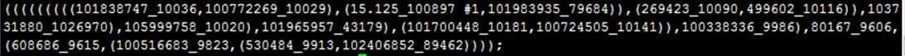

 输入的 CDS比对如下（已经过过滤和格式转换）：

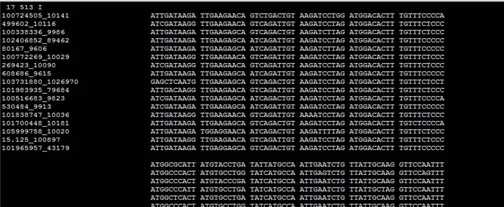

 Null model控制文件设置：

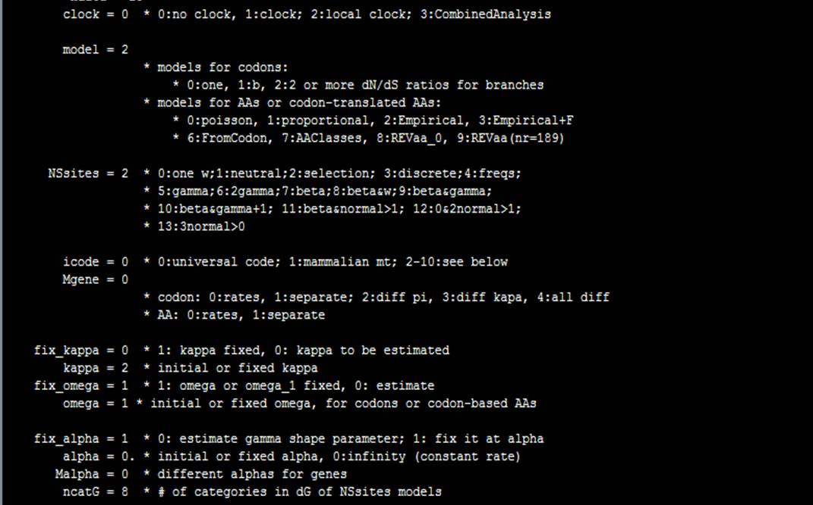 

Alternative model控制文件设置：

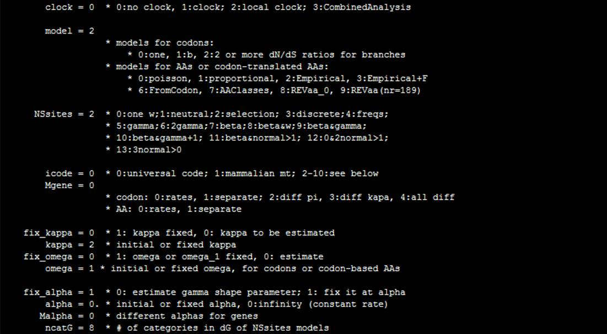

Null model运行后，在主输出文件中可以看到模型的似然值(lnL)和参数个数(np)

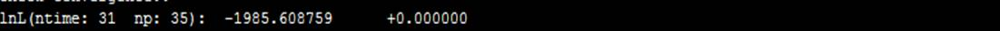

同时也给出了四类位点(见PAML Manual Table 3 [4](#参考文献))的比例和ω值

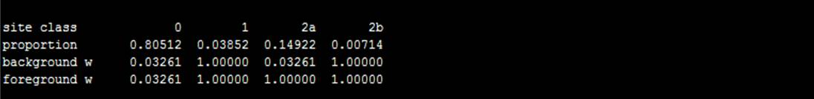

 相应的, alternative model的主输出文件中也有：

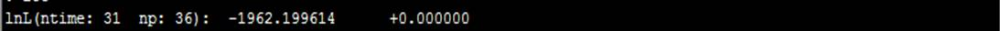

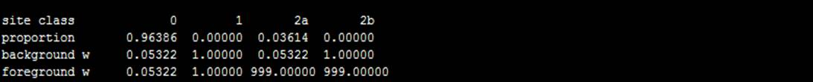

Alternative model的显著性可采用似然比检验: p-value = 1 - qchisq(2ΔlnL, Δnp)。本例p-value = 7.79e-12，支持存在正选择位点。

可以进一步在alternative model主输出文件中找到后验概率高的正选择位点（*为显著）。注意这些位点是针对氨基酸序列，并且在cleandata = 1时去除了原序列中的不确定位点

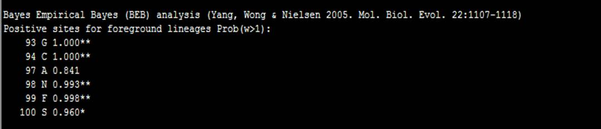

 

为了直观地显示这些位点，可以用MEGA打开相应 CDS比对的fasta文件，并翻译为蛋白序列。下图黑框标出的即为正选择概率较高的93-100位点。这些位点在背景中都极为保守，但在前景（15.125 _100897序列）中发生了替代。这是对branch-site model结果的直观解释。

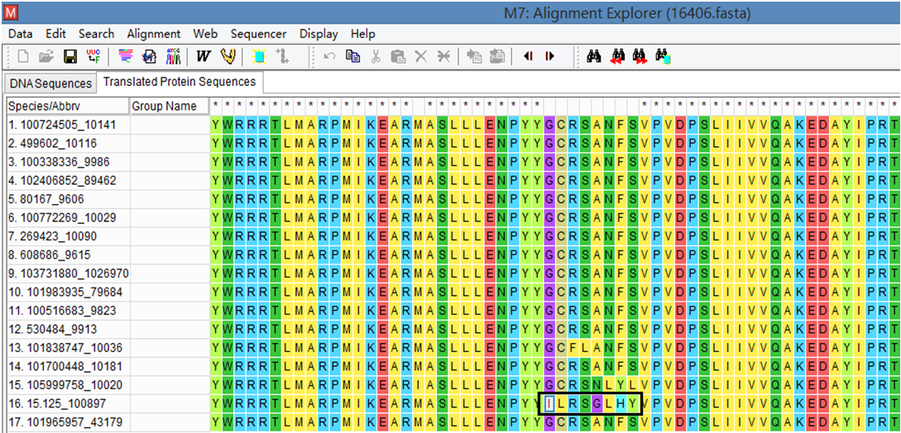

**分支正选择检验与分支快速进化检验比较**

* 正选择检验前景dN/dS>1, 而快速进化检验前景dN/dS大于背景。快速进化既可能由正选择造成，也可能由放松的负选择造成
* 全基因组实例分析显示，两种检验中呈显著的基因个数差不多，但重合率各自都只在70%左右

## 参考文献

1. Castresana J. Selection of conserved blocks from multiple alignments for their use in phylogenetic analysis. Mol Biol Evol. 2000 Apr;17(4):540-52.

2. Yang Z. PAML 4: phylogenetic analysis by maximum likelihood. Mol Biol Evol. 2007 Aug;24(8):1586-91.

3. 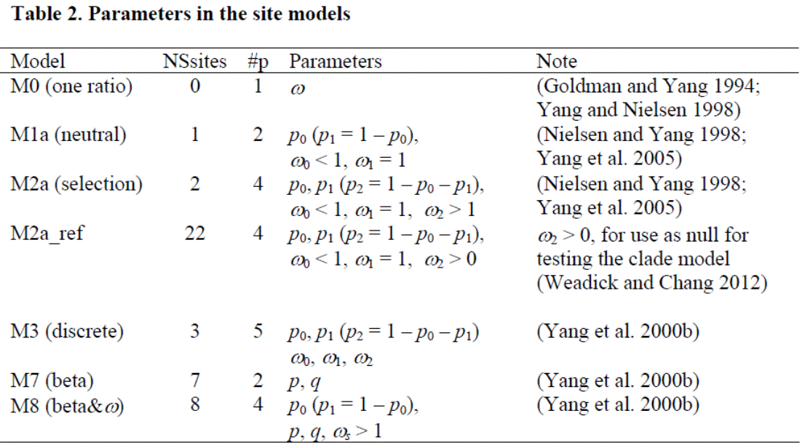

4. 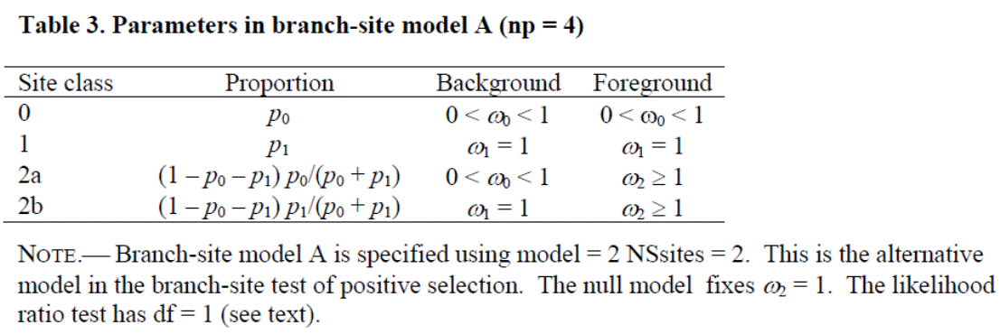

   


 

 
